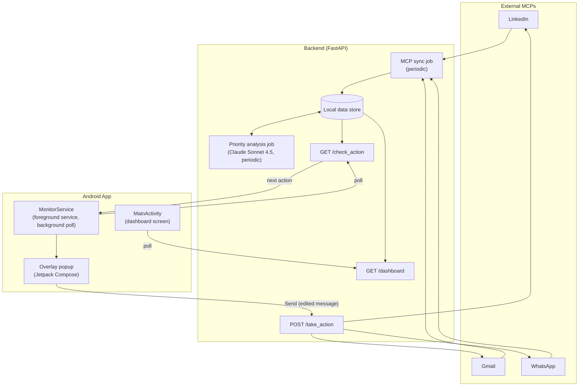
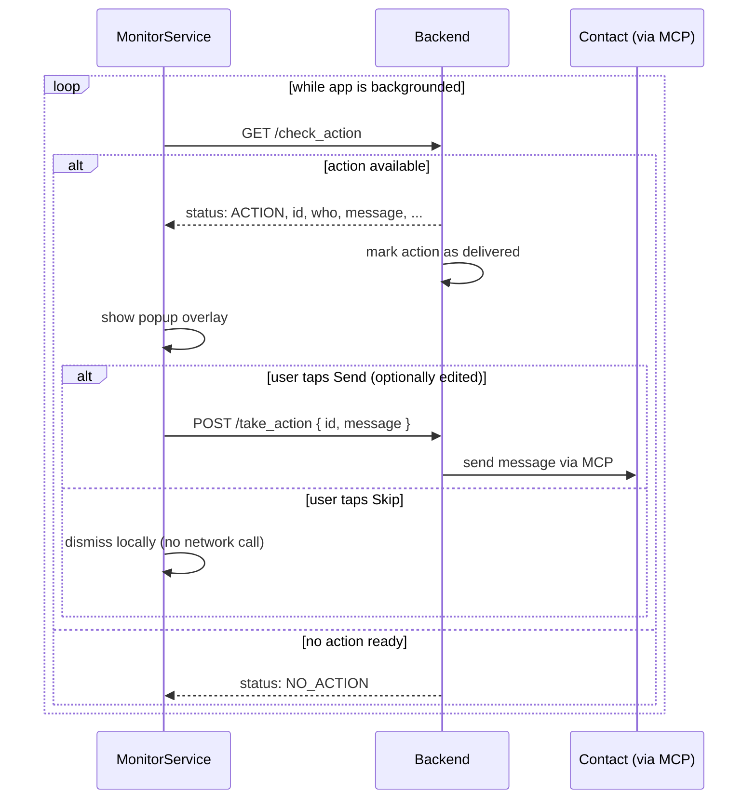

# Kingmaker

An Android app that watches your outreach queue in the background and surfaces the
single highest-priority next action as a floating pop-up — over whatever app you're
currently using — so you can approve, edit, or skip it without breaking flow.

## How it works

- A backend syncs contact/interaction data from MCPs, then periodically runs a
  Claude agent over that data to rank the next best outreach actions.
- The Android app polls for the top action while backgrounded and shows it as a
  system overlay: who it's for, why now, and a pre-drafted message you can edit
  before sending.
- Opening the app itself shows a dashboard (active goal, queue, contact stats) and
  pauses the popup polling — no point popping a card over the app you're already
  looking at.

## Architecture



## Popup flow



## Project structure

```
app/src/main/java/com/example/kingmaker/
├── MainActivity.kt              # Dashboard screen + permission rationale dialogs
├── service/
│   ├── MonitorService.kt        # Foreground service, background polling loop
│   ├── BackendClient.kt         # HTTP client for the 3 backend endpoints
│   ├── NextAction.kt            # /check_action response model
│   ├── DashboardData.kt         # /dashboard response model
│   └── OverlayLifecycleOwner.kt # Lets a Service host a ComposeView
└── ui/
    ├── popup/OverlayPopupContent.kt   # The floating action card
    └── dashboard/DashboardScreen.kt   # The home screen
```

## Running it

**Android app** — open the project root in Android Studio and run the `app`
configuration on a device. On first launch it'll ask (via an in-app dialog, not a
raw system prompt) for the "display over other apps" and notification permissions
it needs to show the popup.

**Backend** — point `BackendClient.BASE_URL` at wherever the server is running, e.g.:

```bash
uvicorn app.main:app --reload --host 0.0.0.0 --port 8000
```

The phone and the backend host need to be on the same network. Cleartext HTTP is
enabled for development (`usesCleartextTraffic="true"`) since this talks to a
local/LAN server — not something to ship as-is.

## API contract

| Endpoint | Method | Purpose |
|---|---|---|
| `/check_action` | GET | Returns the highest-priority undelivered action, or `{"status":"NO_ACTION"}` |
| `/take_action` | POST | `{"id": ..., "message": "..."}` — sends the (possibly edited) message via MCP |
| `/dashboard` | GET | Active goal, queued people, contact stats for the home screen |
